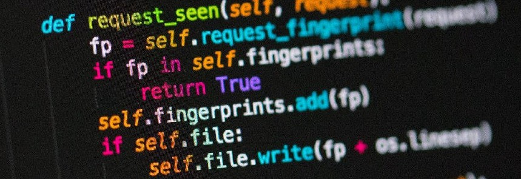

  

# Caroline Almuinha
*Data Engineer at Iteris Consultoria e Software*

I work as a Data Engineer at Iteris Consultoria e Software with skill in the cloud tools Azure Databricks (Apache Spark) and Data Factory, GCP tools (BigQuery, Dataprep, Composer, Cloud Run, Cloud Scheduler).

I worked for six years as a DBA, evolving from Junior to Senior level, dealing with SQL Server, Oracle and MySQL (and soon PostgreSQL) platforms, as well as Windows and Linux operating systems.

I climbed the IT ladder starting my work in the area as a Support Assistant, moving to Developer after studying Systems Analysis and Development, and reaching the much desired opportunity as a DBA after completing a postgraduate degree in Database Administration.
Now as a Data Engineer, completing the second postgraduate degree in Data Science and Big Data.

**Background in:** Machine Learning, Python, Powershell.

**Links:**
* [LinkedIn](https://www.linkedin.com/in/caroline-almuinha)

## Projetos:
Some projects in which I performed or participated:

* **Data Science:** https://link

---
